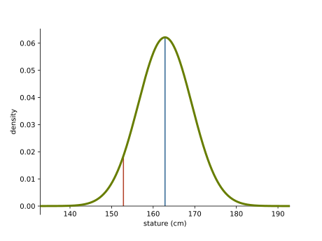
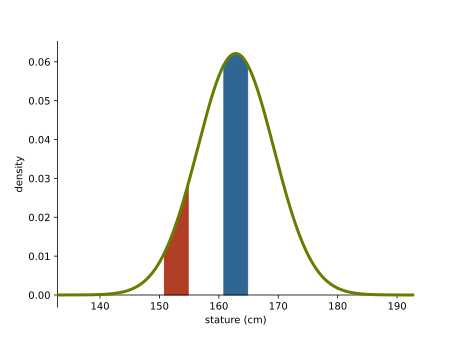

# Probability and probability density

When we think of a probability distribution like a normal distribution, usually an image like this comes to mind.

<figure class="centering" markdown="1">

<figcaption markdown="1">A normal distribution.
</figcaption>
</figure>

This is the distribution on the height of female soldiers in the US army [[1](#references)]. The picture seems relatively straightforward. We have a mean, which is the most likely value and the likelihood of various values decays quickly as we move away from the mean, to the point that a height of 135cm or 195 cm is pretty unlikely.

Now, if I were to ask you which of the two highlighted points had the higher probability, the one at the peak of the distribution or the one just to the left of it? What would you answer?

You might be tempted to answer the first. After all, that is where the function peaks. What's more it's the mean height. Surely, with a distribution like this, the mean is the most likely outcome?

The answer however is that the two points _have the same probability_. A probability of zero. This is a pedantic point, the trick is in how I phrased the question, but it reveals an important subtlety about probability on continuous spaces, like the real numbers. 

To understand the answer, let's ask ourselves what the probability is that we see a female soldier whose height is _exactly_ the same as the mean of the distribution. In this case, the mean is about 163 cm. The probability of seeing anybody with a height between 162 and 163 cm is about 0.06. That is indeed pretty high given the range of heights available.

But that wasn't the question. We wanted the probability of being _exactly_ as tall as the mean height. If we zoom in, we could say that the mean height is 162.8 cm. The probability of seeing someone with a height between 162.8 cm and 162.9 cm is about 0.006. We could zoom in further and say that the mean height is 162.85 cm, or 162.847 cm.  

If we keep going, the probability will shrink and shrink. No matter that we are looking at the peak of the distribution, if we ask for an exact enough match, the probability will go down to zero.

<aside markdown="1">If you want to be _really_ pedantic, you could make the point that there is a limit to how closely we can measure somebody's height. This is a fair point, but when we _model_ the world with a distribution on the real values, we make the assumption that there is no limit to the level of precision we can measure with, at least in theory. Like many modeling assumptions, this is not true, but it serves us well.     
</aside>

So what does the function above say, exactly? The answer is that it's a probability _density_ function. It does express how much probability is around a certain point on the function, and the higher the density at a certain place, the more likely the points around there are to be sampled, but the probability of sampling any single given point is always zero. Even if it's the point that has the most density.

The only thing that has probability in a function like this is an _interval_. The probability of sampling a point in an interval is the area under the density function over that interval. This is how density functions define probability: you integrate them over intervals to give you the probability that you sample a point in that interval. 

For example, the interval of size 4 around the blue point, has a much higher _probability_ than the interval of the same size around the red point. In this sense, our intuition was correct. The points around the peak are more likely to be sampled. However, each individual point still has probability 0 of being sampled.

<figure class="centering" markdown="1">

<figcaption markdown="1">The same distribution with two _intervals_ filled around the points previously highlighted. The interval around the peak has an area under the curve (and thus a probability) of about 0.24,  while the interval to the left of it has an area of about 0.076.
</figcaption>
</figure>

## Intuition

Does that seem counter-intuitive? How can a point have zero probability of being sampled, when some point ultimately does get sampled? One way to wrap your head around this, is to imagine a uniform distribution on $n$ points equally space between $0$ and $1$. For $n=4$ each point has probability $1/4$ of being sampled. As we increase $n$, the probability $1/n$ goes to zero. We can make the probability as close to zero as we like. After we sample, one point must have been chosen, even though the probability of that happening was astronomically small.

<aside>It's the same with the lottery, or being struck by lightning 7 times. It's so unlikely that you might as well think of it as impossible for all practical purposes. However, it will happen to one person (and they will be forgiven for never believing in the principles of probability ever again).</aside>

Probability density functions are the natural limit of this process, where the probability of each individual outcome becomes zero, and we can only use density to describe the relative likelihood of outcomes. Perhaps your intuition is right, and perhaps it's silly to think of an outcome with probability 0 actually existing. Just like a number with infinitely many decimal places can't actually "exist" in our universe. 

In some sense, all these concepts are just "approximations from above". The real world doesn't contain infinitely precise values. However, mathematically, a distribution on infinitely precise values is much easier to work with than a distribution on values with very-high-but-finite precision (which is what we actually have in the real world). And, in practice, the two views agree pretty well.   

## References

[1] Paquette, S. (2009). [Anthropometric survey (ANSUR) II pilot study](https://www.openlab.psu.edu/ansur2/): methods and summary statistics. Anthrotch, US Army Natick Soldier Research, Development and Engineering Center. 