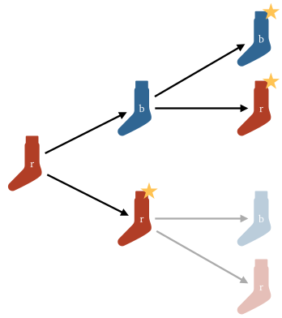

# Without loss of generality

**Without loss of generality**, sometimes abbreviated as **WLOG** is a phrase often found in mathematical settings, specifically in [proofs](proofs).

It refers to a particular type of assumption, that we can make without affecting the generality of our argument. This is not normally the case. If, for example, we are trying to prove that all men are mortal, and we make the _assumption_ that the man in question is Abraham Lincoln, we can say, well, Lincoln is dead, so that proves the case. However, our assumption was restrictive, we haven't proved that all men are mortal, only that Abraham Lincoln was mortal.

Some assumptions can be made _without_ affecting the generality of our argument. This can be very helpful, since it allows us to speak more concretely. In such cases, and author with say something like "We assume, without loss of generality, that ...".

Note that this is an _assertion_ by the author. They may be wrong, and indeed this is very easy to get wrong. Generally, authors will only make this assertion without foundation in cases that are very obviously true, and will help a lot to simplify the proof. It's the kind of situation in proof writing where you ask the reader for a trust in the basic steps so you can focus better on the complicated parts. 

<aside>As with all such shortcuts, you should ensure that you could make the proof more rigorous if you needed to, and only economize for the sake of the reader, once you have the rigorous proof in place.</aside> 

# Example

Consider the classic puzzle

<blockquote>I have a drawer full of socks, which are either red or blue. I grab some socks in the dark. How many should I choose to make sure that I have a matching pair? 
</blockquote>

The answer is three. To prove this, assume **without loss of generality** first that you grab the socks one by one, rather than all at once in a bunch. Then assume, again **without loss of generality** that the first sock is red. The second sock is either red, in which case we have a matching pair, or blue, in which case the third sock will give us a matching pair whether we grab a red or a blue sock.

<figure class="center">

</figure>

We make two WLOG assumptions. The first is that we pick the socks one by one, rather than in a bunch of three. The reasoning here is that even if we picked a bunch of three together, we could also have picked the same socks one by one. How we pick the socks doesn't affect the argument. It does, however, allow us to refer to _the first sock_. This is helpful to make our argument. The socks aren't naturally ordered, and they don't need to be, but we need some way to distinguish them for the sake of our argument.

If we wanted to remove the WLOG, we could say "grab the socks, however you like, now spread them out on the bed in any order. Start with the rightmost sock, assume that it is red." and so on. The WLOG allows us to sidestep this bit of admin. 

The second WLOG lets us assume that the first sock is red. This seems like a big assumption, and we should check that this really doesn't affect the generality of the argument. They key idea here is that the colors red and blue are completely arbitrary. The only thing we know about them is that they are different from each other. We could flip them around, call all red socks blue and vice versa, or talk about orange and green socks. This is why the assumption that the first sock is red doesn't affect the generality. You might say that the argument is symmetric: we could flip the colors and it would hold just the same.

This is one way of getting rid of the WLOG: we could say first "Assume that the first sock is red, then ..." and run the argument as above. Then, we could finish up with "Now, assume that the first sock is blue. Then the above argument holds with the colors reversed."

Another way of getting rid of the WLOG is to say: call the color of the first sock A, and the other color B. And then work out the argument with A and B instead of the actual colors. 

Both versions without WLOG are a little more involved and probably more hard to follow. This isn't always the case. Sometimes a WLOG obfuscates something important, or makes things more complicated. It's up to you as the author of the proof to decide whether a WLOG is the right choice.